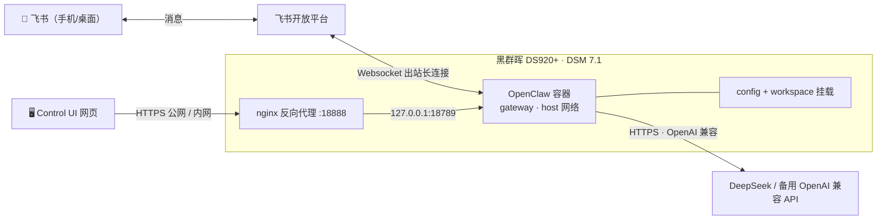

# OpenClaw（小龙虾 🦀）NAS 私有部署

在自建黑群晖 NAS 上用 Docker 部署开源 AI Agent 框架 **OpenClaw**，接入 **DeepSeek V4** 大模型，并通过**飞书**做聊天入口的完整记录。运行在家庭内网，24 小时常驻，数据不出本机。

> 一句话：把 OpenClaw 跑在自己 NAS 上 → 接上 DeepSeek → 在飞书里跟一个叫「小龙虾」的 AI 助手对话，它能查文档、操作飞书云盘/知识库、甚至执行命令行任务。

---

## 为什么做这个

- **私有常驻**：所有服务跑在自家 NAS 上，不依赖第三方云；容器 `unless-stopped` 开机自启，长期在线。
- **真接入真干活**：不是 demo，而是日常在用的「数字小助手」——飞书里发消息就能交互。
- **理解 Agent 真实工作流**：亲手搭一遍网关（gateway）、模型 provider、渠道插件，对「规划 → 执行 → 观察 → 反馈」的 Agent 循环有第一手体感。

## 功能特性

- 🤖 **飞书聊天机器人**：走 websocket **出站长连接**接入飞书，NAS 无需对外开入站端口；支持私聊（按「频道+人」隔离会话）。
- 🧠 **DeepSeek V4 驱动**：`deepseek-v4-flash` / `deepseek-v4-pro`（推理模型，100 万上下文）/ `deepseek-v4-flash-vision-exp`（视觉版，可看图）。
- 🛠 **飞书生态工具**：通过 `@openclaw/feishu` 渠道插件，自动暴露「文档 / 云盘 / 权限 / 知识库」4 组飞书技能。
- 🎨 **图像生成**：自定义 skill 接入文生图模型，对话中直接出图。
- 🌐 **网页控制台（Control UI）**：经群晖 nginx 反代（18888）内外网访问，可视化管理会话与模型。
- 🔌 **可扩展**：Skills / Plugins 体系，随时加能力。

## 架构



**部署要点一句话**：OpenClaw 容器用 **host 网络**跑在 18789 网关端口，**主动向飞书建立 websocket 长连接**（所以飞书功能不需要在 NAS 开任何入站端口）；网页控制台由群晖自带 nginx 反代暴露到 18888。

## 运行环境

| 项 | 说明 |
|---|---|
| NAS | Synology DS920+（黑群晖），Intel Celeron J4125 / 8GB RAM |
| 存储 | 1TB + 200GB，Docker 数据目录 `/volume2/@docker` |
| 系统 | DSM 7.1.1-42962 Update 8（Linux 4.4.180 x86_64） |
| 容器镜像 | `ghcr.io/openclaw/openclaw:2026.8.2`（MIT，基于 node:24-bookworm-slim） |
| 运行模式 | Docker 容器 · **host 网络** · `gateway` 模式 · `unless-stopped` 自启 |
| 部署位置 | `/volume2/docker/openclaw/`（config + workspace 两个挂载） |
| 上线时间 | 2026-09 部署，持续运行中 |

## 目录结构

```
openclaw-nas-deploy/
├── README.md              # 本文档
└── docs/
    ├── deployment.md      # 部署步骤（容器、模型、飞书接入）
    └── troubleshooting.md # 真实踩坑记录
```

## 快速开始（三步总览）

1. **跑容器**：用官方镜像起一个 host 网络的 gateway 容器，挂载 `config` / `workspace` 两个目录（详见 `docs/deployment.md`）。
2. **接模型**：通过 OpenClaw 的 deepseek 插件接入 DeepSeek V4（API key 走 OpenClaw auth profile 存储，不落明文配置文件）。
3. **接飞书**：安装 `@openclaw/feishu` 插件 + 在飞书开放平台建应用，配置 `appId/appSecret` 即可对话。

> ⚠️ 配置文件与密钥均**未上传**到本仓库。仓库内只保留脱敏后的配置结构与部署说明。

## 踩坑速览

部署/使用中踩过的真实坑都记在 [`docs/troubleshooting.md`](docs/troubleshooting.md)，最典型的三个：

1. **Control UI 外网打不开 / origin not allowed** —— 域名/IP 必须逐字加进白名单 `controlUi.allowedOrigins`
2. **宿主机改不动 OpenClaw 配置** —— 配置文件属主/权限是 `1000:1000 600`，要经容器内以 node 用户改
3. **飞书机器人不能发图** —— 需要在飞书开放平台给应用开对应权限

## License

[MIT](https://github.com/openclaw/openclaw/blob/main/LICENSE)（与 OpenClaw 一致）
